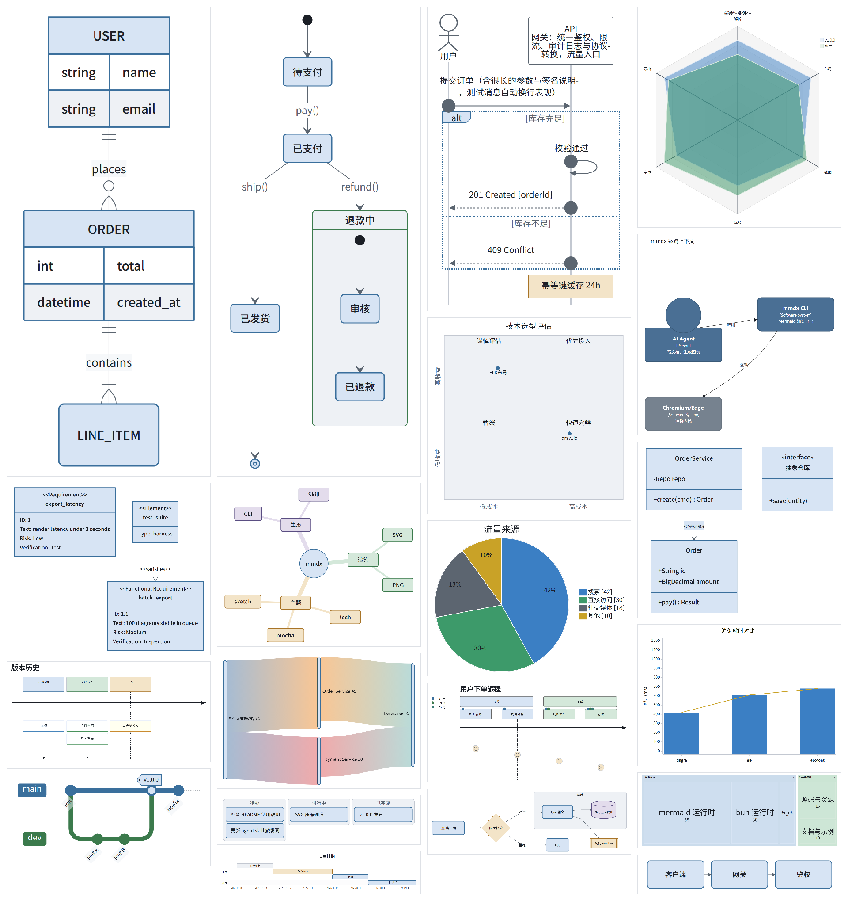

> [中文](README.md) · English

# mmdx

[](https://github.com/daidaiJ/mmdx/releases/latest)
[](LICENSE)

**A diagram export CLI built for office agents**: batch-render mermaid and office fences (table / chart / kpi / compare / vs / funnel / task / progress / gauge / heatmap / swimlane …) in Markdown into PNG — themes, CJK fonts, layout engine, and padding are all built in. No MCP server, no browser extension, and the machine producing the output doesn't need Node.



## 📖 Documentation

| Reader | Doc | What's inside |
|---|---|---|
| 🤖 AI Agent | [docs/AGENT_GUIDE.en.md](docs/AGENT_GUIDE.en.md) | Token-lean: env self-check, diagram picking, flag cheatsheet, JSON contract, error triage |
| 👤 Human user | [docs/HUMAN_GUIDE.en.md](docs/HUMAN_GUIDE.en.md) | Readable: install & deploy, full CLI reference, theming, performance tuning, troubleshooting |
| 🖼 Extension blocks | [docs/EXTENSIONS.en.md](docs/EXTENSIONS.en.md) | One tool-rendered PNG + syntax per fence |
| 📜 Changelog | [CHANGELOG.md](CHANGELOG.md) | Release history |

Every doc is Chinese-first with an English `.en.md` sibling of the same name.

## ✨ Highlights

- **`tech` default theme**: big-tech design-doc look — white background, shape-coded colors (blue = process, amber = decision, green = state, purple = storage), orthogonal edges, plus 6 more presets; all 20 mermaid diagram types covered
- **Bundled CJK font**: Noto Sans SC subset (full GB2312 + Latin, only 1.9 MB) — identical rendering on any machine, correct wrapping for Chinese labels
- **ELK layout engine**: official `@mermaid-js/layout-elk`, lazily loaded for flowcharts only; edge avoidance and long-label wrapping out of the box
- **Pixel-level even padding**: every image is re-cropped to its ink bounding box; symmetric margins are a construction guarantee, not mermaid's unreliable viewBox
- **Extension blocks**: ```table / ```list / ```card / ```chart / ```kpi / ```compare / ```vs / ```funnel / ```task / ```progress / ```gauge / ```heatmap / ```swimlane straight to PNG
- **Office delivery**: `--preset slide|a4|square`, title/source/unit chrome, `--brand` accent; agent-friendly `--json` (including `warnings`)

## 🚀 Quick start

```bash
# Option A: Release binary (windows x64, no Node; rendering uses system Edge/Chrome)
#   Latest: https://github.com/daidaiJ/mmdx/releases/latest
#   Direct: https://github.com/daidaiJ/mmdx/releases/latest/download/mmdx-windows-x64.exe

# Option B: dynamic runtime (needs bun)
#   Download mmdx-dynamic-<tag>.zip, then:
unzip mmdx-dynamic-v*.zip && cd mmdx-dynamic && bun install && bun run src/cli.ts --help

# Option C: clone & build
bun run build && ./dist/mmdx-windows-x64.exe --help
```

### Browser dependency

The render kernel is a real Chromium. Windows 10/11 **ships with Microsoft Edge**, so the binary works out of the box; Chrome works too. Detection order is Edge → Chrome at their common install paths; pass `--browser <path>` for any other Chromium. If none is found it fails fast and lists the searched paths — **Chromium is never downloaded**.

### First image in 30 seconds

```bash
mmdx README.md                              # README-m1.(svg|png), README-m2.(png|svg) …
echo "graph LR; A-->B" | mmdx - -f svg      # single diagram from stdin
```

More (multi-file batches, exact naming, title injection) in the [HUMAN_GUIDE quick start](docs/HUMAN_GUIDE.en.md#quick-start).

## 🖼 Usage

```bash
mmdx a.md b.md other/*.md -o dist/          # multi-file batch, parallel
mmdx diagram.mmd -o out/arch.svg            # exact name; sibling .png written alongside
mmdx report.md --index 2 --title "Architecture" --title-pos bottom
mmdx doc.md -t mocha --background transparent -f png --json
```

Fence languages: `mermaid` (diagrams) plus `table` / `list` / `card` / `chart` / `kpi` / `compare` / `vs` / `funnel` / `task` / `progress` / `gauge` / `heatmap` / `swimlane` (extension blocks, PNG only). For slides: `mmdx doc.md --preset slide --title "…" --source "…"`.

**Card wall** — a ```card fence, one card per line: `emoji | title | description` (emoji and description optional):

```card
🚀 | Render pipeline | single-browser page pool, lossless 2x PNG export
🎨 | Theme system | seven presets, customizable via theme-js and css
```


## 🎨 Themes

| | |
| --- | --- |
| `tech` (default) | Design-doc style: white background, shape coding, thin borders, orthogonal edges |
| `openai` / `openai-dark` | Near-monochrome, thin borders, mint accents |
| `minimal` | Obsidian Minimal: warm neutrals + a single violet accent |
| `latte` / `mocha` | Catppuccin palettes |
| `sketch` | Mermaid `look: handDrawn` whiteboard style |

Layering order: preset → `--theme-js` → `--config` → `--css`. Customization (CSS snippets, full recolor functions) in the [HUMAN_GUIDE theming section](docs/HUMAN_GUIDE.en.md#theming).

## ⚡ Pipeline & performance

One Chromium + page pool + bounded workers; observable via `--profile`:

```
browser-launch  ~0.5s ×1      mermaid-render ~95ms ×diagram
page-init       ~1.2s ×page   screenshot      ~90ms ×diagram (incl. pixel-level re-crop)
```

- ELK (7 MB bundle) parsed lazily: loaded only when a flowchart/graph actually renders; sequence/pie/gantt etc. pay zero cost
- Screenshots serialized across pages (headless Chrome serves one active tab) + viewport fitted to content; a 2x hi-res diagram still lands around ~100 ms
- A hung render always errors after 60s instead of stalling the batch; each diagram is retried once
- PNG is lossless 2x (typical architecture diagram 20–80 KB); SVG is minified by svgo — the official browser build is embedded in the binary (self-contained ESM), so minified SVG is as turnkey as PNG

Tuning knobs (concurrency, viewport, scale) in the [HUMAN_GUIDE performance section](docs/HUMAN_GUIDE.en.md#performance-tuning).

## 🧪 Testing

`bun run tests/run.ts`, two layers — visual review only looks at items the script flags as suspicious:

1. **Library sweep**: 20 mermaid diagram types + table/list/card, rendered in one browser session, then pixel-analyzed (margin symmetry ±8px, content ratio, blank-image detection)
2. **CLI behavior**: exit codes, `--index` naming, bad-block isolation, stdin, JSON contract, 19-file 4-concurrency batch

## License

[MIT](LICENSE)
