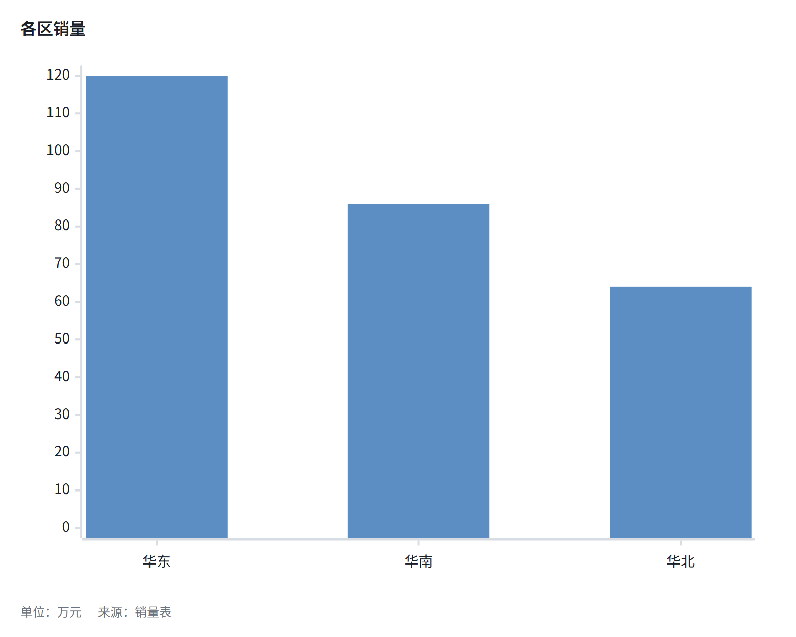
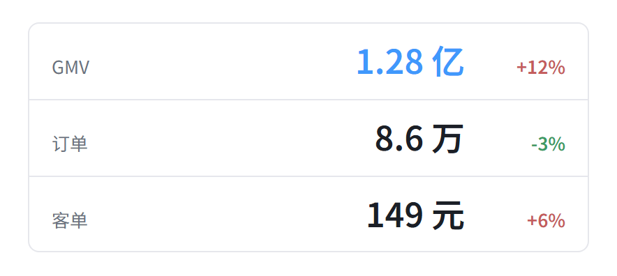
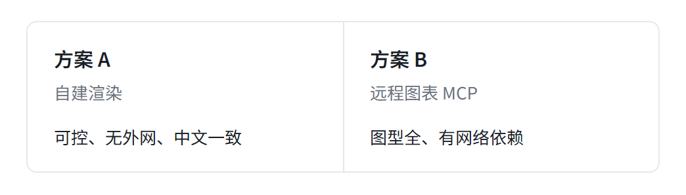
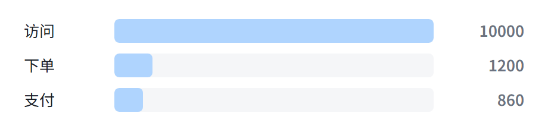
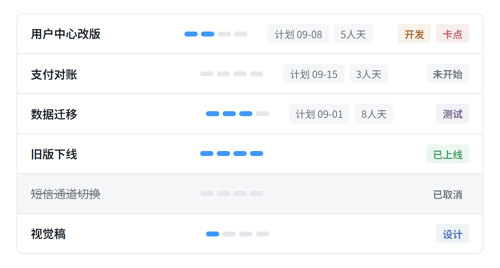
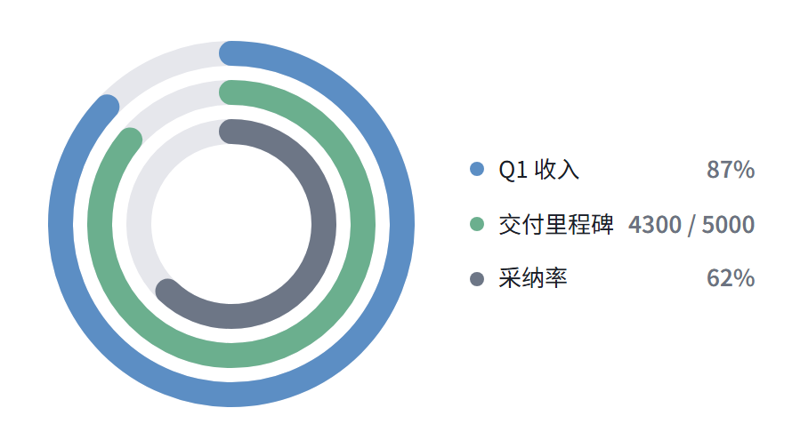
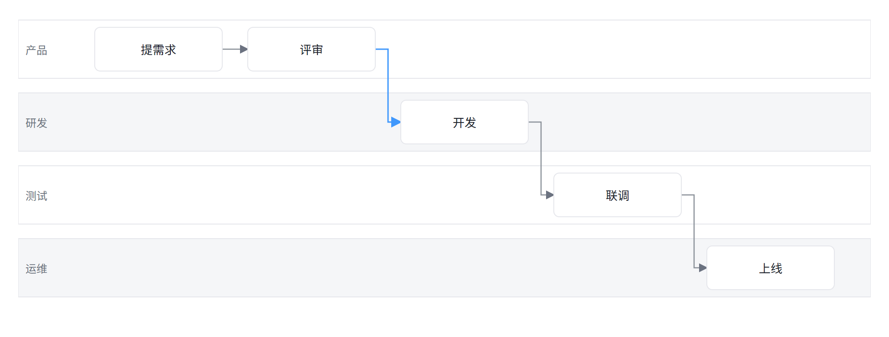

> [English](EXTENSIONS.en.md) · 中文

# 扩展块图鉴

每种围栏一张 **本工具渲染** 的 PNG（`bun scripts/make-review.ts`）。扩展块只出 PNG，均吃 `--title` / `--subtitle` / `--source` / `--unit` 图题层，强调色走 `--brand`。

mermaid 二十种图型拼图见 [tests/contact-sheet.png](../tests/contact-sheet.png)（`bun scripts/make-contact-sheet.ts`，跑完测试后）。

---

## table

GFM 管道表。支持对齐、行内 `**加粗**` 与 `` `code` ``。

````markdown
```table
| 阶段 | 负责人 | 工时 | 状态 |
|:-----|:------:|-----:|:----|
| 需求评审 | 张三 | 3h | ✅ done |
| 核心开发 | 李四 | **16h** | 🔄 in progress |
| `code review` | 王五 | 4h | pending |
```
````


## list

嵌套 Markdown 列表（无序 / 有序可混用）。

````markdown
```list
- 渲染管线
  - 检测浏览器（Edge/Chrome）
  - 复用页面池
- 主题系统
  - 内置 7 套预设
  - `--theme-js` 与 `--css` 自定义
- 导出
  1. SVG（svgo 压缩）
  2. PNG（2x 高清）
```
````


## card

一行一张卡：`emoji | 标题 | 描述`（emoji 与描述可省略）。两列网格。

````markdown
```card
🚀 | 渲染管线 | 单浏览器页池复用，PNG 2x 无损导出
🎨 | 主题系统 | tech/openai/minimal/latte/mocha/sketch 七套预设
🧩 | 扩展语法 | 表格、列表、卡片均可独立成图
📦 | 二进制分发 | Release 直接下载，免 Node 运行时
```
````


## chart

`type: bar | line | pie` + CSV 或 GFM 表。类别 ≤6、系列 ≤2；超限直接失败并提示交给 [AntV mcp-server-chart](https://github.com/antvis/mcp-server-chart)。**不要手写 `xychart-beta`。** 围栏里的 `title` / `unit` / `source` 会印到图题层。

````markdown
```chart
type: bar
title: 各区销量
unit: 万元
source: 销量表
华东, 120
华南, 86
华北, 64
```
````



## kpi

大数字，≤4 行。第三列变化量红涨绿跌；仅第一行数字用强调色。

````markdown
```kpi
GMV | 1.28 亿 | +12%
订单 | 8.6 万 | -3%
客单 | 149 元 | +6%
```
````



## compare

左右对比，恰 2 栏：`名称 | 副标题 | 要点`。

````markdown
```compare
方案 A | 自建渲染 | 可控、无外网、中文一致
方案 B | 远程图表 MCP | 图型全、有网络依赖
```
````



## funnel

转化漏斗，≤6 层：`阶段, 数量`。标签在条外，条宽按数量。

````markdown
```funnel
访问, 10000
下单, 1200
支付, 860
```
````



## task

任务状态快照（不是排期）。状态：未开始 / 设计 / 开发 / 测试 / 已上线 / 已取消，≤10 行。排期用 mermaid `gantt`，多列看板用 `kanban`。

语法：`名称 | 状态 | 日期 | 人天 | 可选标记`

````markdown
```task
用户中心改版 | 开发 | 09-08 | 5人天 | 卡点
支付对账 | 未开始 | 09-15 | 3人天
数据迁移 | 测试 | 09-01 | 8人天
旧版下线 | 已上线
短信通道切换 | 已取消
视觉稿 | 设计
```
````



## progress

同心进度环，≤4。`名称, 百分比` 或 `名称, 数值, 目标`。绝对值用 kpi。

````markdown
```progress
Q1 收入, 87
交付里程碑, 4300, 5000
采纳率, 62
```
````



## swimlane

跨部门交接：`步骤 | 泳道 | 下一步`，≤5 道 ≤8 步。有环、并行、判定用 flowchart。

````markdown
```swimlane
提需求 | 产品 | 评审
评审 | 产品 | 开发
开发 | 研发 | 联调
联调 | 测试 | 上线
上线 | 运维
```
````



---

## 更新样图

```bash
bun run test
bun scripts/make-contact-sheet.ts   # mermaid 拼图 → tests/contact-sheet.png
bun scripts/make-review.ts          # 扩展块 → docs/ext-*.png
```
