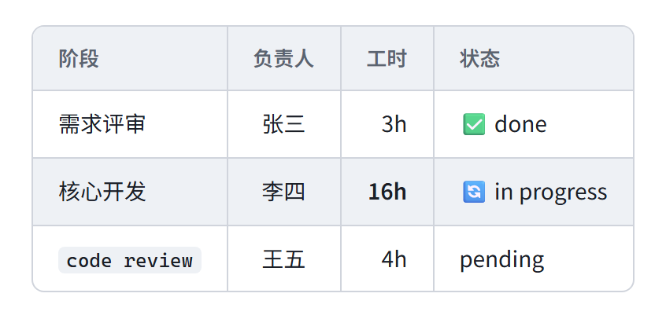
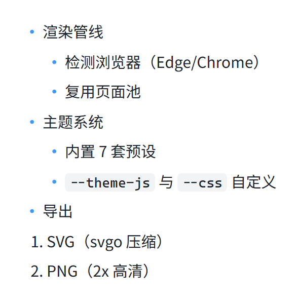
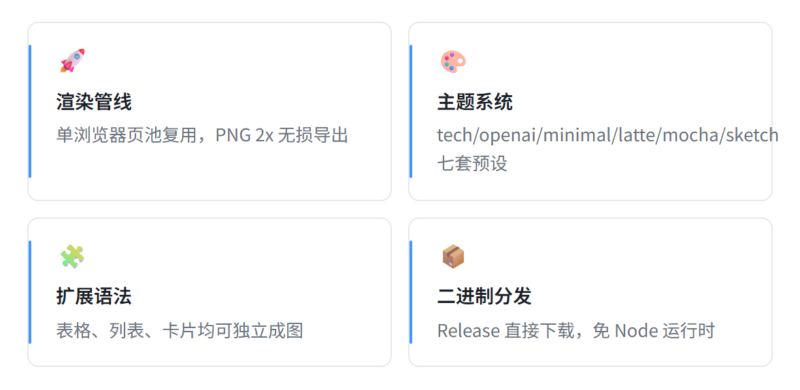

> English · [中文](HUMAN_GUIDE.md)

# HUMAN_GUIDE — Install · Configure · Tune · Troubleshoot (human-readable)

This guide targets **human users** and covers installing mmdx, the full CLI reference, theming, performance tuning, and troubleshooting. The token-lean version for AI agents is [AGENT_GUIDE.en.md](AGENT_GUIDE.en.md); project overview in the [README](../README.en.md).

## Contents

- [Installation](#installation)
  - [Option A: release binary (recommended)](#option-a-release-binary-recommended)
  - [Option B: dynamic runtime](#option-b-dynamic-runtime-needs-bun)
  - [Option C: clone & build](#option-c-clone--build)
  - [Browser dependency](#browser-dependency)
- [Quick start](#quick-start)
- [Full CLI reference](#full-cli-reference)
- [Extension blocks: tables / lists / cards](#extension-blocks-tables--lists--cards)
- [Theming](#theming)
- [Performance tuning](#performance-tuning)
- [Troubleshooting](#troubleshooting)
- [Testing](#testing)

---

## Installation

### Option A: release binary (recommended)

Download `mmdx-windows-x64.exe` from the [release page](https://github.com/daidaiJ/mmdx/releases/latest) — a single file, no Node runtime. Put it on your PATH or call it by full path:

```bash
# direct download
curl -L -o mmdx.exe https://github.com/daidaiJ/mmdx/releases/latest/download/mmdx-windows-x64.exe
./mmdx.exe --version
```

If the GitHub CDN times out, prefix the command with your proxy (e.g. `HTTPS_PROXY=... curl ...`).

### Option B: dynamic runtime (needs bun)

Download `mmdx-dynamic-<tag>.zip` from the release assets and run the source with bun (handy when tweaking themes or render logic):

```bash
unzip mmdx-dynamic-v*.zip && cd mmdx-dynamic
bun install
bun run src/cli.ts --help
```

### Option C: clone & build

```bash
git clone https://github.com/daidaiJ/mmdx.git && cd mmdx
bun install
bun run build          # artifact at dist/mmdx-windows-x64.exe
```

### Browser dependency

The render kernel is a **real Chromium** (driven by puppeteer-core). mmdx neither bundles a browser nor **ever downloads Chromium**:

- Windows 10/11 ships with Microsoft Edge, so the binary works out of the box; Chrome works too
- Detection order: Edge → Chrome at their common install paths (registry + default directories)
- Non-standard install location, or another Chromium: `--browser "C:\path\to\msedge.exe"`
- If none is found it fails fast and lists every searched path — it never hangs

## Quick start

```bash
mmdx README.md                              # README-m1.(svg|png), README-m2.(svg|png) …
mmdx a.md b.md other/*.md -o dist/          # multi-file batch, parallel
mmdx diagram.mmd -o out/arch.svg            # exact name; sibling .png written alongside
echo "graph LR; A-->B" | mmdx - -f svg      # single diagram from stdin
mmdx report.md --index 2 --title "Architecture" --title-pos bottom
mmdx doc.md -t mocha --background transparent -f png --json
mmdx doc.md --list                          # list the fenced blocks found, no rendering
```

Three input forms:

| Input | Behavior |
|---|---|
| `.md` file | Renders all ```mermaid / ```table / ```list / ```card fenced blocks inside |
| `.mmd` file | Renders a single mermaid diagram |
| `-` (stdin) | Reads a single mermaid diagram from standard input |

Output naming: by default next to the input, `<name>-m<N>.svg/.png` numbered by block order; `-o` sets the output directory; when the input holds exactly one diagram, `-o` may be an exact filename.

## Full CLI reference

| Flag | Meaning |
| --- | --- |
| `-o, --out <path>` | Output directory; exact filename when input has one diagram (default: next to input) |
| `-f, --format <fmt>` | `svg` \| `png` \| `both` (default both) |
| `-t, --theme <name>` | `tech` (default) · `openai` · `openai-dark` · `minimal` · `latte` · `mocha` · `sketch` |
| `--background <color>` | Page background, e.g. `white` \| `transparent` \| `#1A1A1A` (dark themes bake in their own background) |
| `--layout <engine>` | `elk` (default, loaded for flowcharts only) \| `dagre` |
| `--scale <n>` | PNG scale factor (default 2) |
| `--width <px>` | Layout viewport width (default 1200) |
| `--title <text>` | Inject a title into diagrams that don't have one |
| `--title-pos <pos>` | `top` (default) \| `bottom` (title below, canvas recomputed) |
| `--icon <pack>` | Iconify pack for `A@{icon: logos:react}` nodes (repeatable; fetched then cached) |
| `--config <file.json>` | Native mermaid config, deep-merged over the theme |
| `--theme-js <file.js>` | JS theming; file body is a `(config, ctx) => config` function |
| `--css <file.css>` | Extra CSS appended to the theme's themeCSS |
| `--browser <path>` | Browser executable override (default: auto-detect Edge/Chrome) |
| `--jobs <n>` | Parallel render count (default 2; single-browser page pool — don't go high) |
| `--profile` | Per-stage timing summary (browser-launch / page-init / mermaid-render / screenshot / svgo) |
| `--list` | List the fenced blocks found and exit, no rendering |
| `--json` | One machine-readable JSON on stdout (files + errors) |
| `-q, --quiet` | Suppress progress lines on stderr |
| `-h, --help` / `-v, --version` | Help / version |

Exit codes: `0` success · `1` at least one render failed (other blocks still render) · `2` usage error.

The `--json` contract:

```json
{
  "theme": "tech", "layout": "elk", "format": "both", "background": "#FFFFFF",
  "blocks": 3, "rendered": 3, "failed": 0,
  "files": ["doc-m1.svg", "doc-m1.png", "…"],
  "errors": [],
  "profile": { "mermaid-render": { "count": 3, "totalMs": 285, "avgMs": 95, "maxMs": 120, "maxLabel": "doc#2" } }
}
```

(`profile` appears only when `--profile` is also passed.)

## Extension blocks: tables / lists / cards

Besides mermaid diagrams, three common markdown structures render directly into styled images. Extension blocks produce **PNG only** — HTML layout has no portable SVG form.

**Table** — a GFM pipe table inside a ```table fence, with alignment and inline bold/code:



**List** — nested markdown lists inside a ```list fence:



**Card wall** — a ```card fence, one card per line: `emoji | title | description` (emoji and description optional):

```card
🚀 | Render pipeline | single-browser page pool, lossless 2x PNG export
🎨 | Theme system | seven presets, customizable via theme-js and css
```



## Theming

### Pick a preset (zero cost)

| Scenario | `-t` |
| --- | --- |
| Design docs / architecture review (default) | `tech` |
| Minimal open-source README | `openai` / `openai-dark` |
| Obsidian notes | `minimal` |
| Dark docs site / dark UI | `mocha` (or `openai-dark`) |
| Casual sharing / blog | `sketch` (hand-drawn) |

### Fine-tuning (--css snippet library, appended after the theme)

```css
/* larger corner radius */   .node rect { rx: 14px; ry: 14px; }
/* subtle node shadow */     .node rect { filter: drop-shadow(0 1px 2px rgba(0,0,0,.10)); }
/* thicker border */         .node rect, .node polygon { stroke-width: 2px; }
/* thicker edges */          .edgePath .path { stroke-width: 2px; }
```

Font size / line color go through `--config` (native mermaid variables; the JSON must be a real file — no process substitution on Windows):

```bash
echo '{"themeVariables":{"fontSize":"17px","lineColor":"#4E5969"}}' > mq.json
mmdx doc.md --config mq.json
```

### Full recolor (--theme-js, file body is the function body)

```js
// brand.js — usage: mmdx doc.md --theme-js brand.js
export default (config, ctx) => {
  // ctx.theme = current theme name; brand colors example
  const ink = '#0D1B2A', brand = '#E4572E', soft = '#FDF0E5';
  config.themeVariables.primaryTextColor = ink;
  config.themeVariables.lineColor = ink;
  config.themeCSS += `
    .node rect { fill: ${soft}; stroke: ${brand}; }
    .node polygon { fill: ${soft}; stroke: ${brand}; }`;
  return config;   // must return config
};
```

Deeper needs (layout params, disabling mirrored actors…) use `--config` deep-merge over native settings (`flowchart.curve`, `sequence.mirrorActors`…).

**Layering order**: preset → `--theme-js` → `--config` → `--css`.

## Performance tuning

`--profile` reports per-stage timings — look at the data before touching anything:

```
browser-launch  ~0.5s ×1      mermaid-render ~95ms ×diagram
page-init       ~1.2s ×page   screenshot      ~90ms ×diagram (incl. pixel-level re-crop)
```

| Lever | Advice |
| --- | --- |
| Batch > 30 blocks | `--jobs 4`; the default 2 is enough — single-browser page pool, diminishing returns and memory pressure beyond that |
| PNG too large | Lower `--scale` (default 2; 1 is fine for chat); PNG is lossless, typical architecture diagram 20–80 KB |
| Wide diagram squashed | Raise `--width` (default 1200); horizontal flowcharts tolerate 1600+ |
| SVG only | `-f svg` skips the screenshot stage |
| First image slow | browser-launch + page-init is fixed cost (~1.7s), amortized over batches; normal for single images |

Pipeline facts: one Chromium instance + page pool + bounded workers; ELK (7 MB bundle) lazily loads for flowchart/graph only, zero cost for sequence/pie/gantt etc.; screenshots serialize across pages (headless Chrome serves one active tab); a hung render trips a 60s circuit breaker, each diagram retried once.

## Troubleshooting

| Error / symptom | Nature | Fix |
| --- | --- | --- |
| `no Chrome/Edge found … --browser <path>` | No browser in environment | Install Edge/Chrome, or pass `--browser "<path-to-msedge.exe>"` (any Chromium); never auto-downloads |
| `render timed out after 60s` | Resource pressure / browser hang | CLI already retried; rerun the whole command, or isolate with `--jobs 1` if persistent |
| `icon pack "xxx" not found` | Network down (unpkg) | Drop `--icon`, or run once online to warm the cache |
| Chinese glyphs turn into boxes | Shouldn't happen (font bundled) | Check whether `--config`/`--theme-js` overrode fontFamily |
| `Parsing error` (exit 1) | **Diagram syntax error** | Fix per the mermaid line info; other blocks are unaffected |
| exit 2 | Usage error | Compare against `mmdx --help` |
| SVG text disappears in non-browser tools (Inkscape etc.) | The svg is HTML-implemented | Use `-f png` instead |
| Text overlapped by edges | Manual `style` changed the background, defeating the theme's label mask | Remove manual styles; use classDef only to emphasize individual nodes |
| Same-named md files overwriting each other in one `-o` dir | Naming collision | Separate directories, or use `--index` to export specific blocks |

Rule of thumb: **exit 2 = wrong flags; Parsing error = wrong diagram; look the error up in the table before reinstalling anything**.

## Testing

`bun run tests/run.ts`, two layers — visual review only looks at items the script flags as suspicious:

1. **Library sweep**: 20 mermaid diagram types + table/list/card, rendered in one browser session, then pixel-analyzed (margin symmetry ±8px, content ratio, blank-image detection)
2. **CLI behavior**: exit codes, `--index` naming, bad-block isolation, stdin, JSON contract, 19-file 4-concurrency batch
