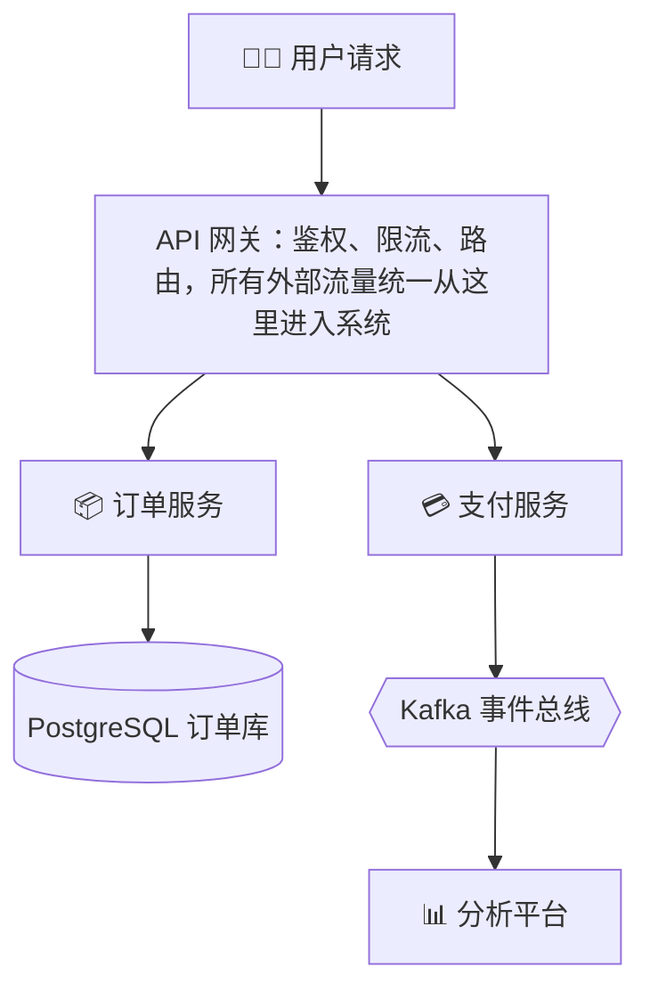
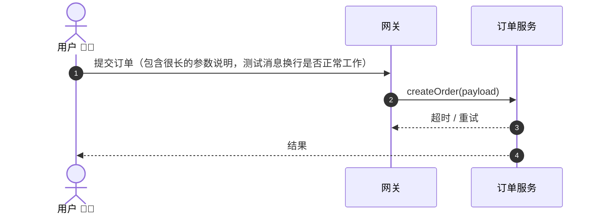
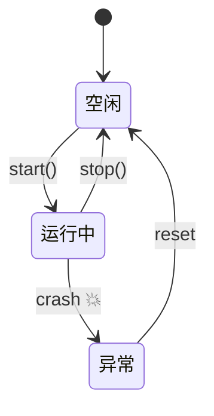

# Features

```mermaid
flowchart TD
    U["🧑‍💻 用户请求"] --> GW["API 网关：鉴权、限流、路由，所有外部流量统一从这里进入系统"]
    GW --> SVC1["📦 订单服务"]
    GW --> SVC2["💳 支付服务"]
    SVC1 --> DB[("PostgreSQL 订单库")]
    SVC2 --> MQ{{"Kafka 事件总线"}}
    MQ --> ANL["📊 分析平台"]
```

```mermaid
sequenceDiagram
    autonumber
    actor u as 用户 🧑‍💻
    participant g as 网关
    participant o as 订单服务
    u->>g: 提交订单（包含很长的参数说明，测试消息换行是否正常工作）
    g->>o: createOrder(payload)
    o-->>g: 超时 / 重试
    o-->>u: 结果
```

```mermaid
stateDiagram-v2
    [*] --> 空闲
    空闲 --> 运行中: start()
    运行中 --> 空闲: stop()
    运行中 --> 异常: crash 💥
    异常 --> 空闲: reset
```
