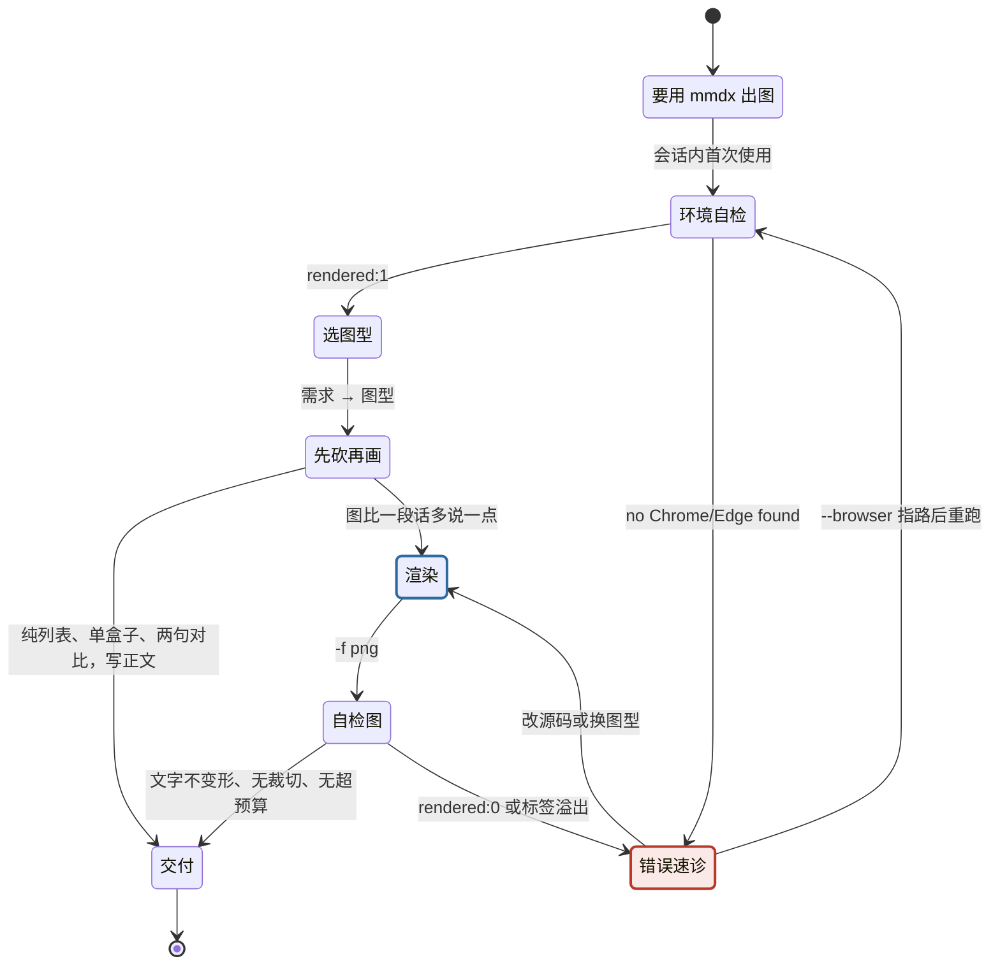

```mermaid
stateDiagram-v2
  s0: 要用 mmdx 出图
  s1: 环境自检
  s2: 选图型
  s3: 先砍再画
  s4: 渲染
  s5: 自检图
  s6: 交付
  s7: 错误速诊
  [*] --> s0
  s0 --> s1: 会话内首次使用
  s1 --> s2: rendered:1
  s1 --> s7: no Chrome/Edge found
  s7 --> s1: --browser 指路后重跑
  s2 --> s3: 需求 → 图型
  s3 --> s6: 纯列表、单盒子、两句对比，写正文
  s3 --> s4: 图比一段话多说一点
  s4 --> s5: -f png
  s5 --> s6: 文字不变形、无裁切、无超预算
  s5 --> s7: rendered:0 或标签溢出
  s7 --> s4: 改源码或换图型
  s6 --> [*]
  classDef risk fill:#FBE9E7,stroke:#B93A2B,stroke-width:2.5px
  classDef path stroke:#2E6B9E,stroke-width:2.5px
  class s7 risk
  class s4 path
```
