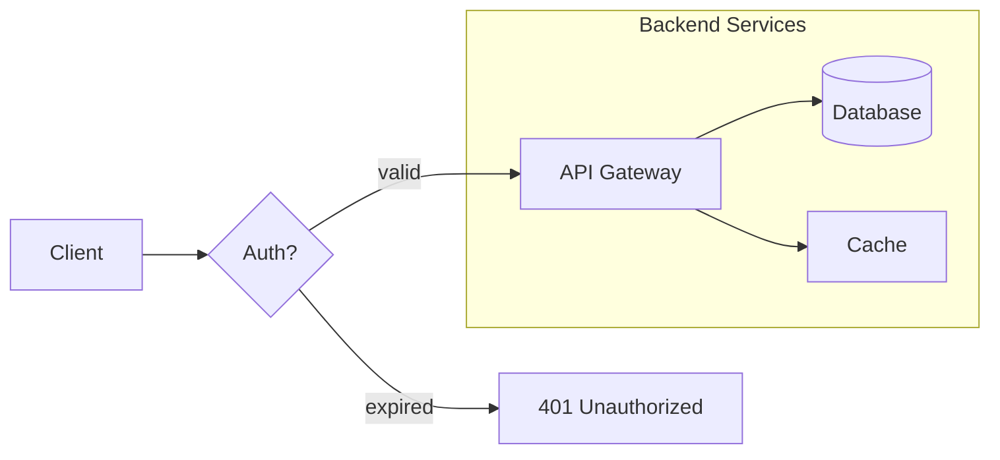
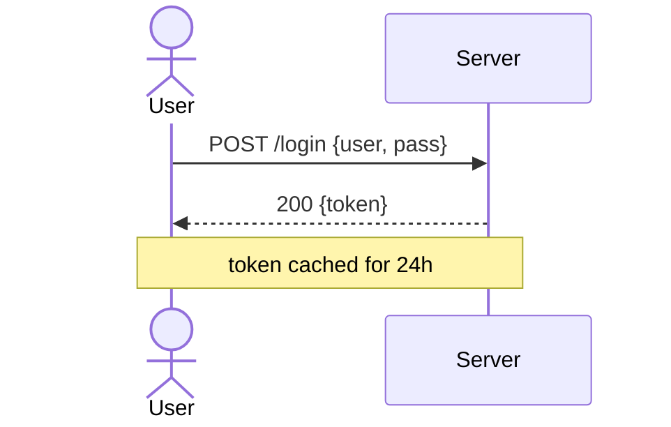
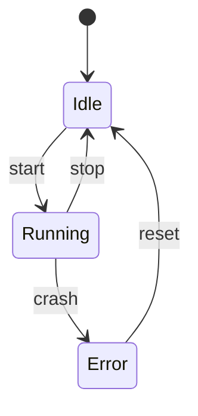

# Sample

## Pipeline

```mermaid
flowchart LR
    A[Client] --> B{Auth?}
    B -- valid --> C[API Gateway]
    B -- expired --> D[401 Unauthorized]
    C --> E[(Database)]
    C --> F[Cache]
    subgraph services [Backend Services]
        C
        E
        F
    end
```

## Login flow

```mermaid
sequenceDiagram
    actor U as User
    participant S as Server
    U->>S: POST /login {user, pass}
    S-->>U: 200 {token}
    Note over U,S: token cached for 24h
```

```mermaid
stateDiagram-v2
    [*] --> Idle
    Idle --> Running: start
    Running --> Idle: stop
    Running --> Error: crash
    Error --> Idle: reset
```
