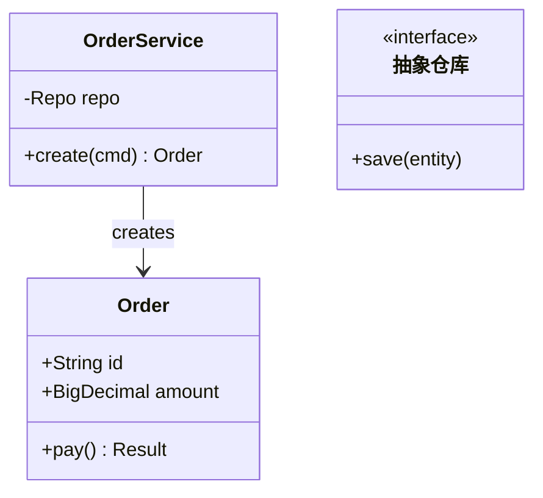

```mermaid
classDiagram
    class Order {
        +String id
        +BigDecimal amount
        +pay() Result
    }
    class OrderService {
        -Repo repo
        +create(cmd) Order
    }
    OrderService --> Order : creates
    class 抽象仓库 {
        <<interface>>
        +save(entity)
    }
```
