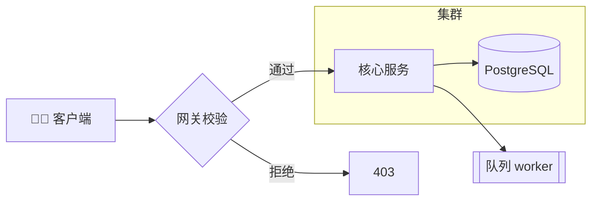

```mermaid
flowchart LR
    A["🧑‍💻 客户端"] --> B{网关校验}
    B -- 通过 --> C["核心服务"]
    B -- 拒绝 --> D["403"]
    C --> E[("PostgreSQL")]
    C --> F[["队列 worker"]]
    subgraph 集群
      C
      E
    end
```
