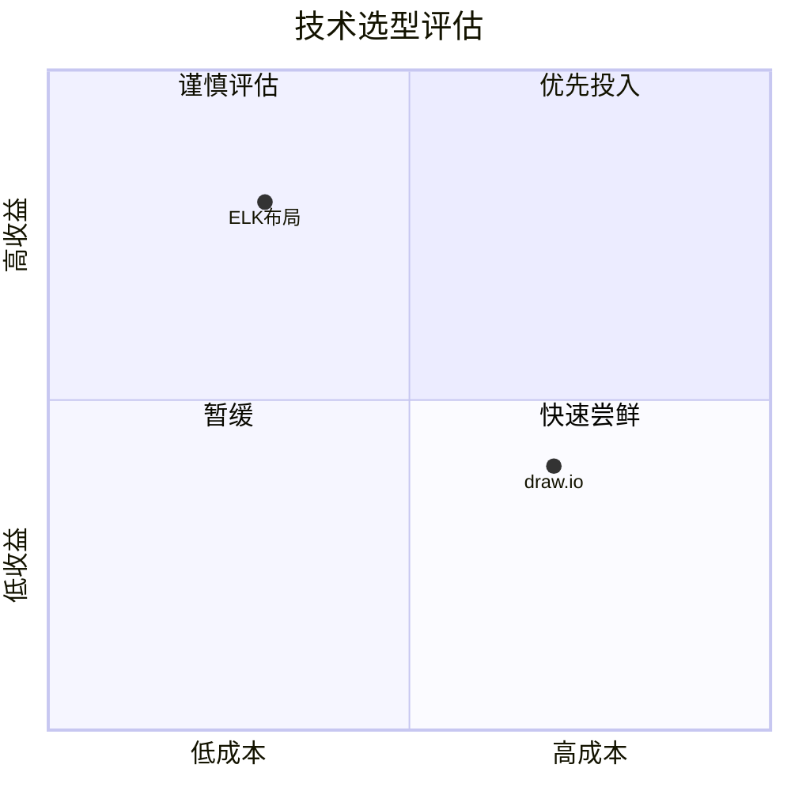

```mermaid
quadrantChart
    title 技术选型评估
    x-axis 低成本 --> 高成本
    y-axis 低收益 --> 高收益
    quadrant-1 优先投入
    quadrant-2 谨慎评估
    quadrant-3 暂缓
    quadrant-4 快速尝鲜
    ELK布局: [0.3, 0.8]
    draw.io: [0.7, 0.4]
```
