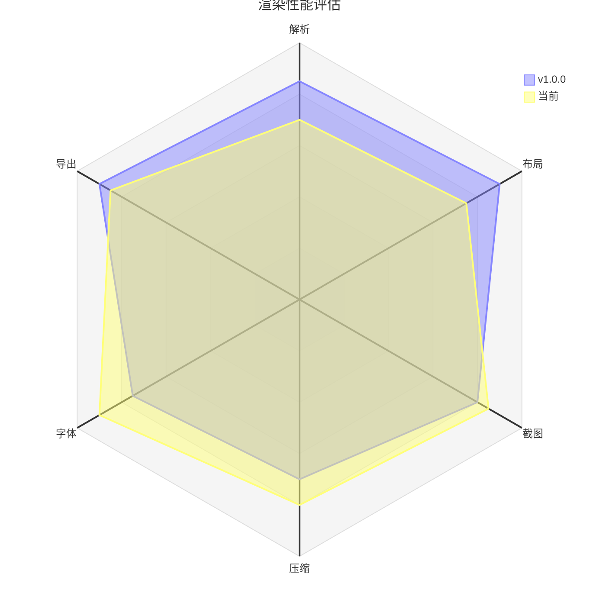

```mermaid
---
title: 渲染性能评估
---
radar-beta
  graticule polygon
  axis m["解析"], s["布局"], e["截图"]
  axis h["压缩"], g["字体"], a["导出"]
  curve a["v1.0.0"]{85, 90, 80, 70, 75, 90}
  curve b["当前"]{70, 75, 85, 80, 90, 85}
  max 100
  min 0
```
