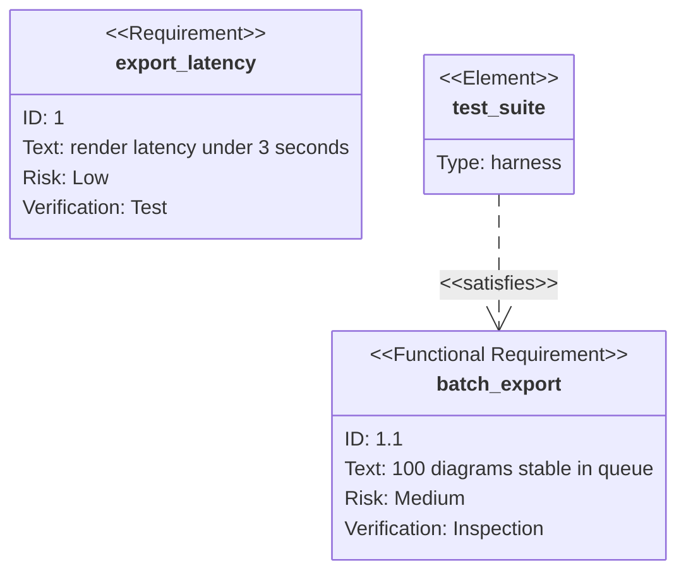

```mermaid
requirementDiagram
    requirement export_latency {
        id: 1
        text: render latency under 3 seconds
        risk: low
        verifymethod: test
    }
    functionalRequirement batch_export {
        id: 1.1
        text: 100 diagrams stable in queue
        risk: medium
        verifymethod: inspection
    }
    element test_suite {
        type: harness
    }
    test_suite - satisfies -> batch_export
```
