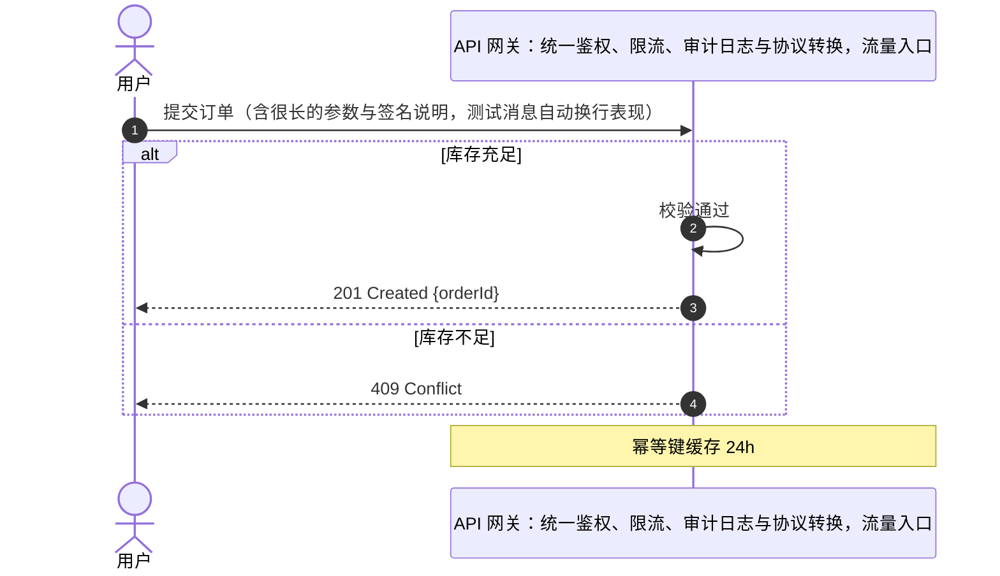

```mermaid
sequenceDiagram
    autonumber
    actor u as 用户
    participant a as API 网关：统一鉴权、限流、审计日志与协议转换，流量入口
    u->>a: 提交订单（含很长的参数与签名说明，测试消息自动换行表现）
    alt 库存充足
        a->>a: 校验通过
        a-->>u: 201 Created {orderId}
    else 库存不足
        a-->>u: 409 Conflict
    end
    note over a: 幂等键缓存 24h
```
